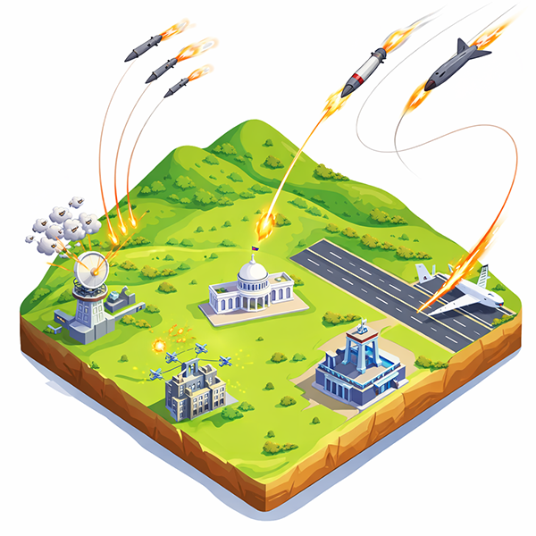

<p align="center">
  
</p>

<h1 align="center">Threat Defense Command</h1>

<p align="center">
  <em>A terminal-based air defense strategy game written in Python.</em>
</p>

---

You are the commander of a city's integrated defense network. Enemy forces are
launching a coordinated attack using a mix of ICBMs, cruise missiles, short-range
rockets, and drones. Your radar network detects incoming threats, your interceptors
can stop them — but your ammunition is limited, time is short, and not everything
can be saved.

A built-in **Computer Advisor** evaluates the threat board in parallel with you,
scoring each threat by urgency, target value, and intercept probability. You can
consult it at any time. After each wave, a debrief screen compares your decisions
against what the advisor would have recommended — so you can learn, adapt, and
improve your strategy over time.

The game escalates across waves: early waves teach you the basics with a single
slow rocket; later waves throw coordinated multi-vector assaults that can
overwhelm even an experienced player. Destroying certain assets — radar stations,
the military HQ, the power station — triggers **cascade effects** that degrade
your remaining defensive capabilities, making each subsequent wave harder to
survive. Lose the Presidential Palace and it is over.

---

## Requirements

- Python 3.9 or later
- No external libraries required — uses only the Python standard library
  (`curses`, `random`, `math`, `datetime`, `json`)

---

## Running the Game

```bash
git clone https://github.com/yourname/war_game.git
cd war_game
python3 main.py
```

The game runs entirely in your terminal. A minimum terminal size of
**120 × 36 characters** is recommended for the best experience. Resize your
terminal window before launching if needed.

---

## Controls

| Key | Action |
|---|---|
| `SPACE` | Pause / resume the simulation |
| `/` | Toggle the Computer Advisor panel |
| `ESC` | Quit the game |
| `ENTER` | Confirm / advance to next wave |
| `BACKSPACE` | Delete last character in command buffer |

### Assigning Interceptors

Type a threat ID followed by an interceptor key. The command prompt echoes
your input as you type, and a **contextual hint line** appears as soon as a
valid threat number is recognised — showing interceptor availability and
success probability against that specific threat.

```
T01P    Assign Patriot   to threat T01
T01I    Assign Iron Dome to threat T01
T01B    Assign Airborne  to threat T01
T01X    Remove assignment from threat T01
```

Assignments execute automatically on the next simulation tick. You do not need
to pause to issue commands — assignments can be typed while the game is running.

### Interceptor Reference

| Key | System | Strength |
|---|---|---|
| `P` | Patriot | Effective vs ICBMs and cruise missiles |
| `I` | Iron Dome | Effective vs rockets and drones |
| `B` | Airborne | Effective vs cruise missiles and drones — requires Airport intact |

---

## Defended Assets

| Asset | Strategic Weight | Capability |
|---|---|---|
| Presidential Palace | 40% | **Critical** — game ends if destroyed |
| Military HQ | 20% | Coordinates interceptor response |
| Radar Station Alpha | 10% | Northern detection coverage |
| Radar Station Beta | 10% | Eastern detection coverage |
| Airport | 10% | Enables airborne interceptors |
| Power Station | 10% | Powers all electronic systems |

Losing assets triggers **cascade effects** — damaged radar reduces detection
range, a destroyed Military HQ introduces response delays, a lost Power Station
degrades all systems. Like chess, losing certain pieces makes the rest of your
position progressively harder to defend.

---

## Scoring

At the end of each wave the game computes a **Strategic Integrity Index (SII)**
— a weighted average of all asset integrities:

| SII | Result |
|---|---|
| 80 – 100% | Decisive Victory |
| 60 – 79% | Tactical Victory |
| 40 – 59% | Pyrrhic Survival |
| 20 – 39% | Strategic Defeat |
| 0 – 19% | Total Defeat |

---

## Logging

All game events are written to `game.log` in the project directory. Each
session is appended with a timestamp header, and each wave is clearly delimited.
Logging can be disabled by setting `LOG_TO_FILE = False` in `core/config.py`.

Example log output:
```
════════════════════════════════════════════════════════════
SESSION START — 2026-03-07 19:14:02
════════════════════════════════════════════════════════════

────────────────────────────────────────────────────────────
[2026-03-07 19:14:05] WAVE 1 BEGIN — Single rocket attack
────────────────────────────────────────────────────────────
[2026-03-07 19:14:18] WAVE 1 | T01 DETECTED — Short-Range Rocket
[2026-03-07 19:14:22] WAVE 1 | Assigned iron_dome → T01
[2026-03-07 19:14:24] WAVE 1 | INTERCEPTED: T01 → Power Station

────────────────────────────────────────────────────────────
[2026-03-07 19:14:24] WAVE 1 END — SII: 100.0% — DECISIVE VICTORY
────────────────────────────────────────────────────────────
```

---

## Project Structure

```
war_game/
│
├── main.py                     Entry point and main game loop
│
├── core/
│   ├── config.py               All game parameters — tune balance here
│   ├── clock.py                Simulation clock and real-time pacing
│   └── game_state.py           Central state object — single source of truth
│
├── simulation/
│   ├── physics.py              Distance, movement, blast radius, CEP calculations
│   ├── threat.py               Threat class — trajectory, detection, TTI
│   └── wave_generator.py       Builds escalating waves of threats
│
├── defense/
│   ├── asset.py                Defended asset integrity and cascade effects
│   └── interceptor.py          Interceptor batteries, assignments, reload timers
│
├── ai/
│   └── advisor.py              Computer Advisor — threat scoring and recommendations
│
├── ui/
│   ├── display.py              All terminal rendering via curses (single module)
│   └── input_handler.py        Keypress capture and command parsing
│
└── reporting/
    └── debrief.py              Post-wave debrief and human vs advisor comparison
```

The architecture is intentionally layered — `display.py` is the only module
that touches the terminal. Replacing it with a graphical renderer would leave
every other module unchanged.

---

## Configuration

All game parameters live in `core/config.py`. Notable values you can adjust:

| Constant | Default | Effect |
|---|---|---|
| `TICK_SECONDS` | `1.0` | Simulated seconds per game tick |
| `REAL_TICK_MS` | `200` | Real milliseconds per tick |
| `BASE_RADAR_RANGE` | `60` | Radar detection radius in km |
| `LOG_TO_FILE` | `True` | Enable / disable game log |
| `LOG_FILE` | `game.log` | Log output filename |

Weapon speeds, detection ranges, interceptor success rates, and wave
compositions are all defined there and can be freely tuned.

---

## Background

This game grew out of a broader exploration of **discrete-event simulation**
and **stochastic modeling** — the same mathematical foundations used to model
elevator systems, sewer networks, and data network utilization. The attack
waves use a non-homogeneous Poisson process for threat arrival timing; weapon
accuracy is modeled using the circular error probable (CEP) with a Rayleigh
distribution; and the Computer Advisor implements a multi-factor scoring
function drawn from queuing theory and operations research.

A full technical document covering the simulation methodology, the military
strategy concepts, and the game design decisions is forthcoming.

---

## License

MIT License — free to use, modify, and distribute.
